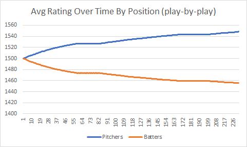
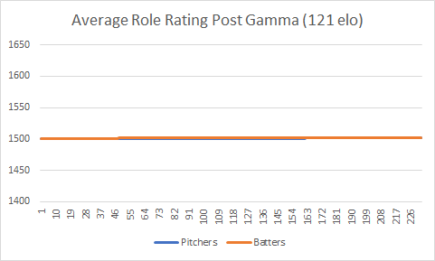

### Baseball Statistics

#### Definitions

Team Rating - Rating given to a team that predicts how likely they are to win a game.

TBI Rating - Team Based Individual rating. Rating given to players on a team. The average rating of the predicts the match outcome.

Play Rating - Rating determined by the outcomes of plate appearances. Their performance should be more directly rated this way.

#### Plate Outcomes

In order to update the rating of a batter and a pitcher after a plate appearance, it is necessary to specify the value to the pitcher and batter that certain batting outcomes have. We use two sets of values based on similar work done [here](https://www.baseballhq.com/it/content/research-using-elo-ratings-rank-mlb-players), as well as proposing another way of valuing outcomes. We operate as though anything good for the batter is bad for the pitcher, and vice versa. This isn't true in reality since the pitcher can throw out runners stealing bases - this had nothing to do with the batter.

##### TTO
Three true outcomes

##### BIP
Balls in play

##### Weighted

#### Graphs

2010 play-by-plays with no gamma adjustment, using weighted outcomes. Pitchers 'win' or get favorable outcomes on average much more often than batters. No matter which set of outcome values used, the game between one pitcher and one batter isn't fair. This causes the rating of all pitchers to increase and the batters to decrease.

2010 play-by-plays with gamma adjustment, with weighted outcomes again. Adding this gamma adjustment adjusts the expected outcome of the match. A batter with 1500+gamma Elo should have a favorable outcome against a pitcher with 1500 Elo 50% of the time. Then, when a pitcher gets a good outcome against a batter of equal rating (which happens often), the ratings aren't updated as heavily. This prevents pitchers' scores from being inflated.

#### Match Prediction